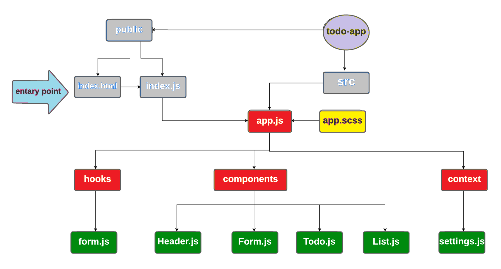

# todo-app

## Author: Tariq Abu-Laban

## Setup

In the project directory, you can run:

`npm start`

- Runs the app in the development mode.
- Open http://localhost:3000 to view it in the browser.

## Development Process

### Phase 1:

- Basic To Do List Management, using Hooks
  - Global State
  - Context API

### Phase 2:

- adding an Setting Form so that users can save their preferences for the application, allowing them to change some of the default behaviors

  - Implement a custom Form Hook
  - save the selection to local storage.

## UML

## Links

- [Netlify](https://friendly-todo-app.netlify.app/)
